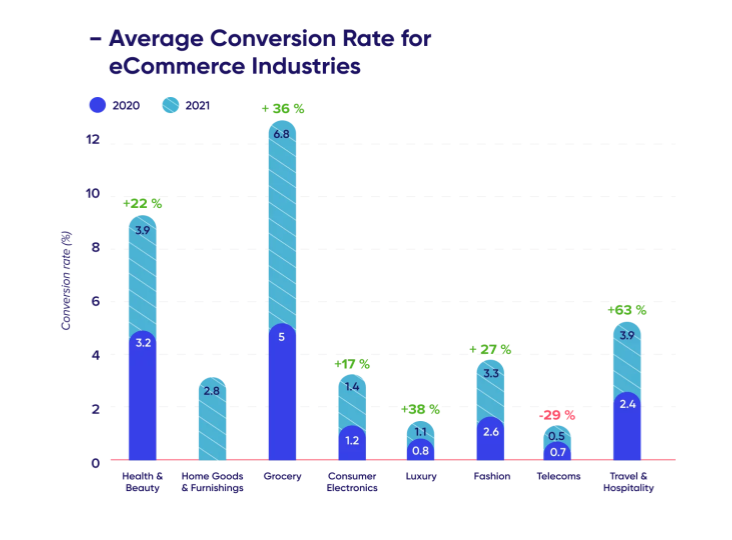
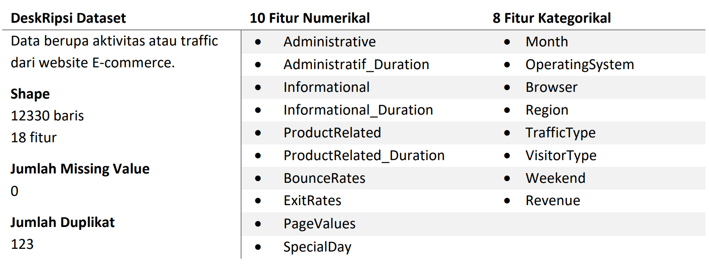
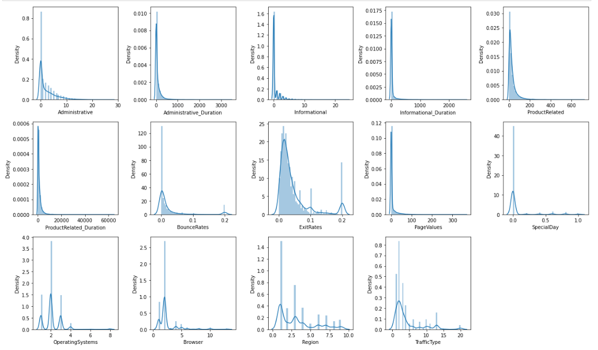
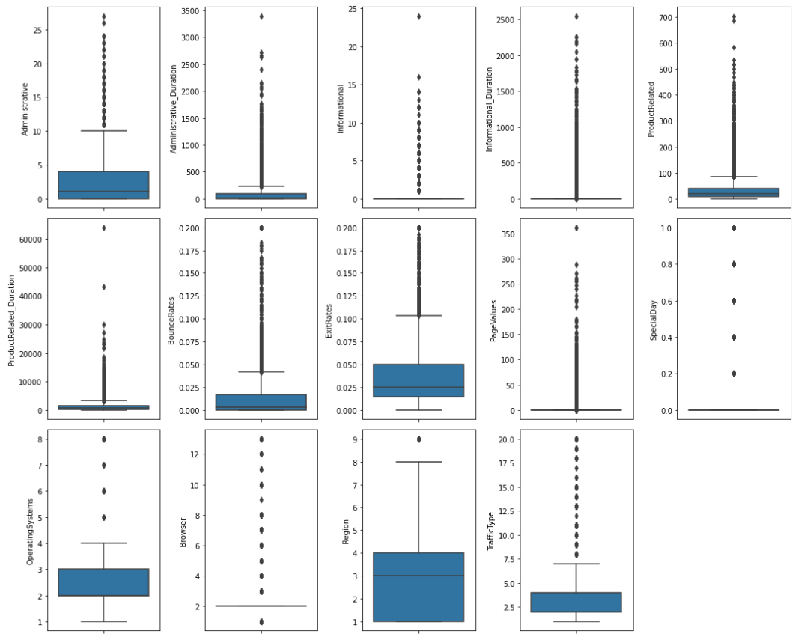
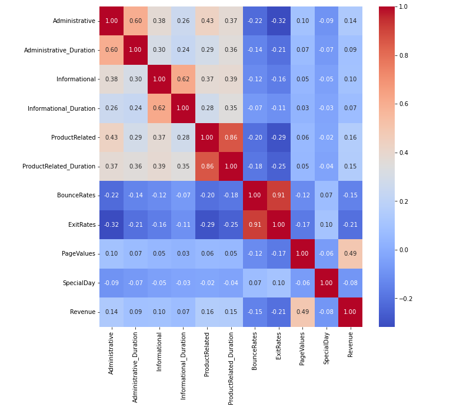

# 🛒 **Online Shoppers Purchasing Intention** 🛒
---
## 📂 **Stage 0 : Problem Statement**
### Problem Statement
- Majestic merupakan suatu perusahaan E-commerce (marketplace) yang menyediakan berbagai macam kebutuhan untuk pelanggan. 
- Pada satu tahun terakhir, perusahaan hanya menghasilkan **Conversion Rate** sebesar **15%** dari pelanggan yang mengunjungi website.
- Pada masa pandemi (2020-2021) menurut data [**Digital Experience Benchmark Report**](https://contentsquare.com/blog/ecommerce-conversion-rate/), Conversion Rate diberbagai industri E-commerce mengalami **peningkatan** rata-rata sebesar **28%** dikarenakan secara signifikan kebiasaan pelanggan untuk berbelanja beralih ke sistem online. Hal ini akan menjadi suatu kesempatan besar bagi perusahaan untuk meningkatkan revenue.

 

  <kbd> </kbd>  
  Gambar 1 – Rata-rata Conversion Rate untuk Industri E-commerce

### Objectives
- Mendapatkan **insight** mengenai pola kebiasaan pelanggan dalam berselancar di website.
- **Memprediksi** pengunjung yang memiliki kecenderungan membeli atau tidak.
- Memberikan **bisnis rekomendasi** yang tepat guna meningkatkan kecenderungan pelanggan untuk membeli.

### Goals
- Membuat model machine learning yang dapat memprediksi customer yang berpeluang menghasilkan revenue.
- Diharapkan model dapat menigkatkan Revenue Conversion Rate sebesar 28%.

### Business Matrics
-  Revenue Conversion Rate
---

## 📂 **Stage 1 : Exploratory Data Analysis**
### Dataset

  Tabel 1 – Ringkasan Dataset 
  <kbd> </kbd>  

### Descriptive Statistics

  <kbd> </kbd>  
  Gambar 2 – Distribusi Dataset

Hasil analisis statistik deskriptif untuk fitur-fitur numerik adalah sebagai berikut :
1. Distribusi data secara keseluruhan cenderung **positively-skewed** (Mean > Median).
2. Administrative, Administrative_Duration, Informational, Informational_Duration, ProductRelated, ProductRelated_Duration, BounceRate, PageValues memiliki ekor distribusi yang pang panjang dengan nilai yang **menumpuk disekitar angka 0**.
3. Dari kedua kondisi diatas dan dari analisa menggunakan boxplot mayoritas fitur memiliki outlier.  
 

  <kbd> </kbd>  
  Gambar 3 – Distribusi Dataset dengan Boxplot

 
 

Sedangkan hasil analisis statistik deskriptif untuk fitur-fitur kategorik adalah sebagai berikut.
1. Beberapa fitur memiliki nilai yang **telah di encoding** seperti OperatingSystems, Browser, Region, dan TrafficType, sehingga apabila diperlukan interpretasi nilai maka diperlukan data tambahan.
2. Mayoritas pengunjung  berasal dari **region wilayah 2** dan ketika berselancar di website menggunakan **OperatingSystem jenis 2* dengan **Browser jenis 1**.
3. **Returning Visitor** merupakan pengunjung yang paling dominan. Pada fitur VisitorType ini perlu dilakukan penanganan terhadap nilai Other.
4. Terdapat dua bulan yang hilang pada fitur Month yaitu January dan April. Bulan **Mei** memiliki jumlah pengunjung terbanyak, lalu diikuti dengan bulan November.

### Analysis

  <kbd> </kbd>  
  Gambar 4 – Heatmap Analisis Multivariat

 

Hasil analisis korelasi antar fitur adalah sebagai berikut:
1. **PageValues** memiliki **korelasi yang tinggi** terhadap fitur **target** yaitu Revenue. Semakin tinggi nilai PageValue, maka semakin tinggi juga kemungkinan pelanggan untuk membeli.
2. Sedangkan **BounceRates** dan **ExitRates memiliki** nilai **korelasi negatif** terhadap **Revenue**, artinya semakin kecil nilai kedua fitur tersebut maka revenue akan semakin tinggi.
3. Beberapa fitur yang memiliki **multikorenialitas** diantaranya adalah :
    - ProductRelated dengan ProductRelated_Duration
    - Adminisitrative dengan Adminisitrative_Duration
    - Informational dengan Informational_Duration
    - BounceRates dengan ExitRates

### Insight
tulis

---

## 📂 **Stage 3 : Data Pre-processing**
### Workflow Data Pre-processing
 

  <kbd> </kbd>  
  Gambar 5 – Workflow Data Pre-Processing

### Data Cleaning
#### 1. Handle Missing Value
Tidak ada nilai yang kosong pada kolom, sehingga tidak dilakukan handling missing value.

#### 2. Handle Duplicated Value
Terdapat 125 data yang duplikat. Hanya diambil satu data untuk masing-masing duplikat.

#### 3. Handle Outlier
Presentase outlier menggunakan analisis Z-Score dalam data adalah 17.90%, nilai tersebut cukup besar, maka outlier tidak dihilangkan. Tidak dilakukan handle outlier ini juga kerana diasumsikan bukan dari kesalahan dalam pengambilan data.

#### 4. Feature Transformation
Transformasi feature tidak menggunakan log karena data memiliki banyak value dengan nilai 0. PowerTransformer Yeo-Johnson dipilih untuk membuat distribusi lebih mendekati normal (Guassian) dan mendukung value data memiliki nilai positif atau negatif.

#### 5. Feature Extraction
Mengubah data kategorikal kedalam numerikal. 
- OperatingSystems, Browser, Region, TrafficType sudah memiliki feature numerik
- Month akan dilakukan label encoding, pada bulan dibuat label peringkat berdasarkan jumlah peringkat user dari yang terbesar.
- VisitorType, Weekend, dan Revenue akan dilakukan One Hot Encoding

#### 6. Handle Class Imbalance
Handle imbalance menggunakan SMOTE dengan hasil False 10297 dan True 5148.

### Feature Enginering
#### 1. Feature Selection
Pada tahap feature selection ini fitur yang redundant adalah :
- Administrative - Administrative_Duration
- Informational - Informational_Duration
- ProductRelated - ProductRelated_Duration
- BounceRates - ExitRates
- Administrative - Administrative_Duration
- Informational - Informational_Duration
- ProductRelated - ProductRelated_Duration

Ketiga terakhir akan dibuat feature extraction untuk mendapatkan durasi tiap page nya, sedangkan BounceRates - ExitRates, akan dipilih salah satu, yaitu ExitRates

#### 2. Feature Extraction
Pembuatan feature :
- Duration per Page Administrative
- Duration per Page Informational
- Duration per Page ProductRelated

**Data yang dipilih :**
- Duration per Page Administrative
- Duration per Page Informational
- Duration per Page ProductRelated
- ExitRates
- PageValues
- SpecialDay
- Month
- VisitorType_Returning_Visito
- Revenue_True
---
## 📂 **Stage 4 : Modeling and Ealuation**
---
## 📂 **Stage 5 : Business Insight and Recomendation**
